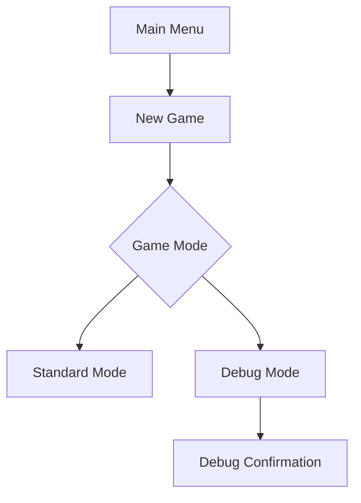

# Debug Mode Integration Plan

## 1. User Flow Adjustment

## 2. Debug Mode Features
- **Core Features**:
  - Single player spawn
  - Flat test arena
  - Physics parameter sliders
  - Animation debug tools
- **Extended Features**:
  - Level skipping (F6)
  - Invincibility toggle (F7)
  - Frame-by-frame mode (F8)

## 3. UI/UX Design
- **Visual Indicators**:
  - Red border in debug mode
  - Persistent debug HUD
  - Tooltip explanations
- **Menu Design**:
  - Clear mode selection
  - Confirmation dialog
  - Warning for debug activation

## 4. Testing Protocol
1. Unit Tests:
   - Mode switching
   - Feature toggles
   - Asset reloading
2. Integration Tests:
   - Debug + standard mode interaction
   - Save file compatibility
3. Stress Tests:
   - Rapid feature toggling
   - Extreme parameter values

## 5. Error Handling
- **Safety Measures**:
  - Debug mode flag in save files
  - Parameter value clamping
  - Fallback default assets
- **Recovery**:
  - Auto-reset on crash
  - Debug mode disable shortcut (Shift+F1)

## 6. Documentation
- **In-Game**:
  - Help menu with debug controls
  - Tooltips for all features
- **External**:
  - Markdown documentation
  - Video tutorials
  - Troubleshooting guide