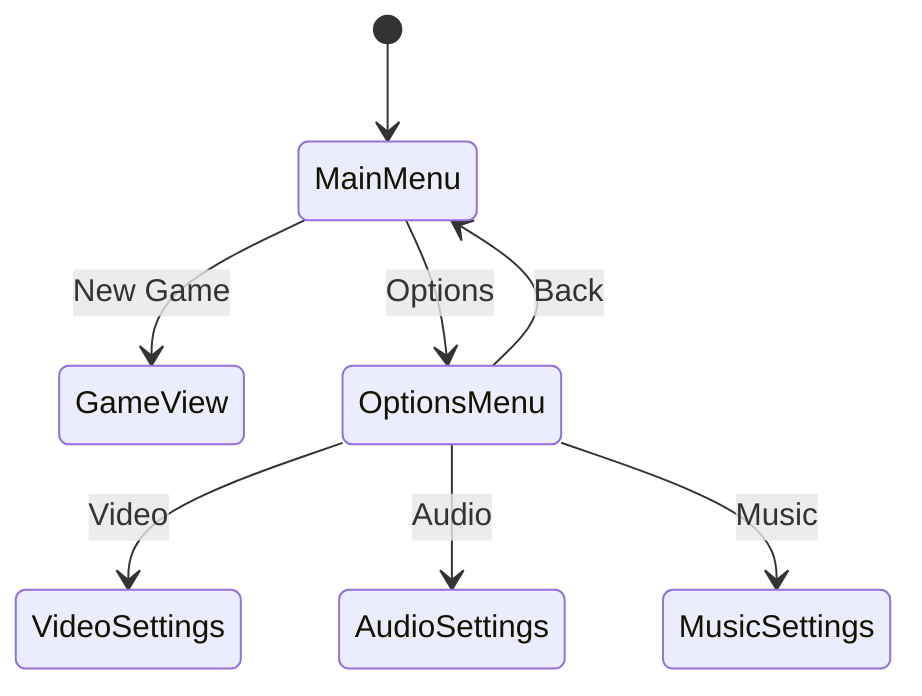

# Main Menu System Design

## Overview
Enhanced menu system for Arcade Fighter with:
- Main menu screen
- Options submenu
- Resolution switching
- Audio controls

## Menu States


## Components

### Main Menu
- New Game button
- Options button
- Exit button (optional)
- Animated background (existing)

### Options Menu
**Video Settings:**
- Resolution dropdown (SD/HD/FHD)
- Fullscreen toggle
- VSync toggle

**Audio Settings:**
- Master volume slider
- SFX volume slider

**Music Settings:**
- Music volume slider
- Track selection

## Technical Implementation

### Button System
- Hover effects
- Click animations
- Sound feedback
- State management

### Resolution Switching
```python
RESOLUTIONS = {
    "SD": (800, 600),
    "HD": (1280, 720), 
    "FHD": (1920, 1080)
}

def set_resolution(res):
    width, height = RESOLUTIONS[res]
    window.set_size(width, height)
    window.set_viewport(0, width, 0, height)
```

### Audio System
Placeholder implementation:
```python
class AudioManager:
    def __init__(self):
        self.master_volume = 1.0
        self.sfx_volume = 1.0
        self.music_volume = 1.0
    
    def play_sound(self, sound):
        sound.play(volume=self.master_volume * self.sfx_volume)
```

## UI Layout
```
Main Menu Layout:
[ ARCADE FIGHTER ]
[  New Game  ]
[  Options   ]
[   Exit     ]

Options Menu Layout:
[ OPTIONS ]
[ Video > ]
[ Audio > ]
[ Music > ]
[  Back   ]