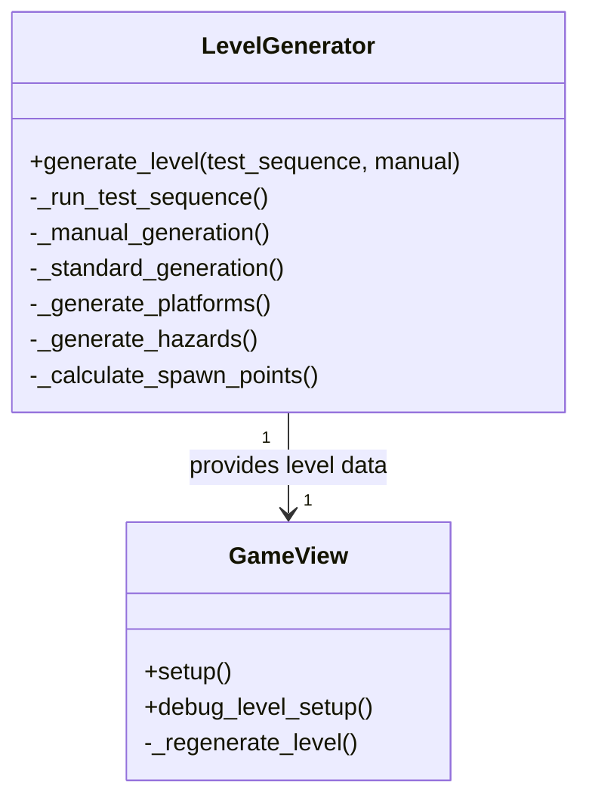

# Level Generation System Implementation Plan

## Overview
This document outlines the implementation of the level generation system for the arcade fighter game, including test sequences and debug mode integration.

## Architecture



## Implementation Steps

1. **LevelGenerator Class**
   - Handles all level generation logic
   - Supports three modes:
     - Standard generation (normal gameplay)
     - Test sequence (validation)
     - Manual generation (debug mode)

2. **GameView Integration**
   - Modified setup() to use LevelGenerator
   - Added debug controls for manual generation
   - Performance monitoring display

3. **Test Sequence**
   - Platform placement validation
   - Collision map verification
   - Performance benchmarks

4. **Debug Mode Features**
   - Manual level regeneration
   - Parameter adjustment (platform count, hazard density)
   - Performance stats display

## Error Handling Strategy
- Custom LevelGenerationError exceptions
- Fallback to simple level on failure
- Detailed error logging
- User feedback in debug HUD

## Performance Monitoring
- Track generation times
- Count errors and passed tests
- Auto-scale complexity
- Display stats in debug overlay

## Usage Examples

**Standard Game:**
```python
level = generator.generate_level()
game_view.apply_level(level)
```

**Test Sequence:**
```python 
level = generator.generate_level(test_sequence=True)
```

**Debug Mode:**
```python
level = generator.generate_level(manual=True)
```

## Next Steps
1. Implement GameView integration
2. Add debug controls to HUD
3. Create test assets
4. Performance tuning